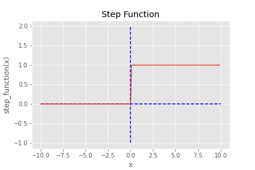
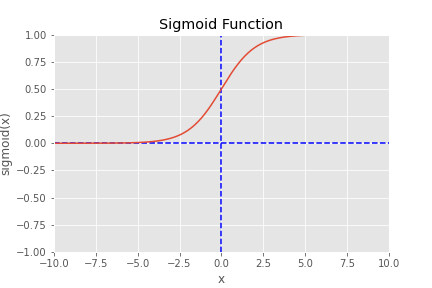
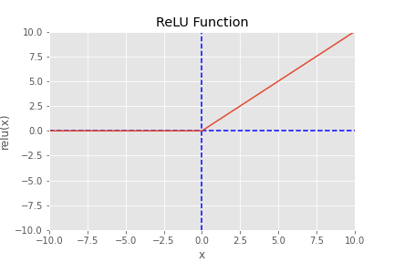
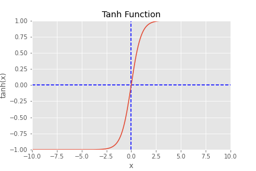
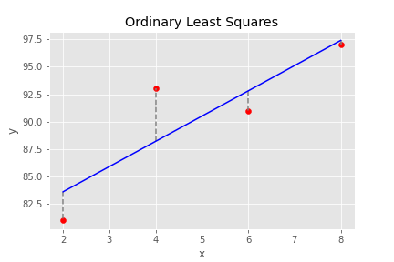

## AND, OR, XOR
- Single Layer Perceptron
- ADALINE

## Activation Function
- Step Function

```python
def step_function(x):
    return np.array(x > 0, dtype=np.int)
```

- Sigmoid

```python
def sigmoid(x):
    return 1 / (1 + np.exp(-x))
```

- ReLU  

```python
def relu(x):
    return np.maximum(0, x)
```

- tanh  

```python
def tanh(x):
    return np.tanh(x)
```


## Loss Function  
- SSE(Sum of Squared Error)
$$
SSE = \sum{\epsilon^2} = \sum{(y - \hat{y})^2}
$$

- MSE(Mean Squared Error)
$$
MSE = mean(SSE) = \cfrac{SSE}{n} = \cfrac{\sum{(y - \hat{y})^2}}{n}
$$

- RMSE(Root Mean Squares Error)
$$
RMSE = \sqrt{mean(SSE)} = \sqrt{\cfrac{SSE}{n}} = \sqrt{\cfrac{\sum{(y - \hat{y})^2}}{n}}
$$

- Categorical Cross-entropy

## Optimizer
- OLS(Ordinary Least Squares)

```python

def ordinary_least_squares(x, y):
    x_mean = np.mean(x)
    y_mean = np.mean(y)

    numerator = 0
    denominator = 0

    for i in range(len(x)):
        numerator += (x[i] - x_mean) * (y[i] - y_mean)
        denominator += (x[i] - x_mean) ** 2

    m = numerator / denominator
    c = y_mean - m * x_mean

    return m, c
```
```python
x = np.array([2, 4, 6, 8])
y = np.array([81, 93, 91, 97])

m, c = ordinary_least_squares(x, y)
y_pred = m * x + c

plt.scatter(x, y, color='red')
plt.plot(x, y_pred, color='blue')
plt.vlines(x, y_pred, y, colors='gray', linestyles='dashed')

plt.title('Ordinary Least Squares')
plt.xlabel('x')
plt.ylabel('y')
plt.savefig('images/ols.png')
plt.show()
```

- SGD
- ADAM

## Metrics
- Loss
- Accuracy

## 지도학습 (Supervised Learning)

### 회귀(Regression) 모델 
LinearRegression: 
$ Y = b_0 + b_1X + \epsilon $

Lasso: 
Ridge: 
ElasticNet: Lasso + Ridge 
DecisionTreeRegressor: 
RandomForestRegressor:

### 분류(Classification) 모델 
LogisticRegression: 
SVC: 
KNeighborsClassifier:  
DecisionTreeClassifier: 
RandomForestClassifier: 

## 비지도학습 (Unsupervised Learning)
### 군집(Clustering) 모델
KMeans:  
DBSCAN: 
AgglomerativeClustering: 
SpectralClustering: 
### 차원 축소(Dimensionality Reduction) 모델
PCA: 주성분 분석 모델
LDA: 선형 판별 분석 모델
t-SNE: t-SNE 차원 축소 모델


## DNN

## CNN

## RNN
- DQN
- A3C

## GAN
- DCGAN